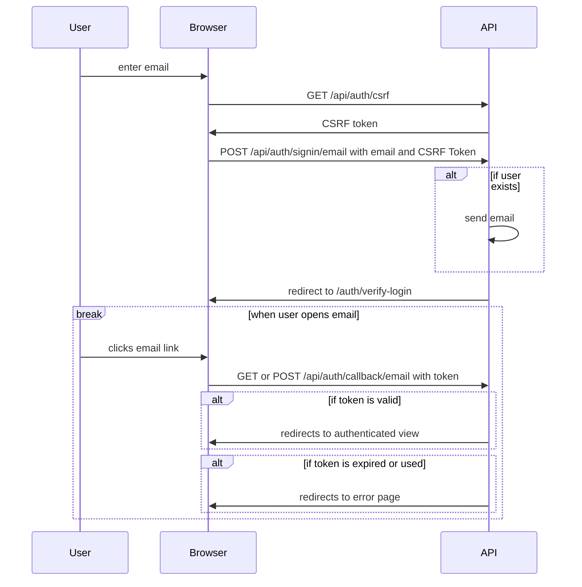

# Authentication

We are using [NextAuth](https://next-auth.js.org/) to manage authentication.
Authentication is handled on the api server since there are plans to have multiple apps with a common login.

Presently only the [email provider](https://next-auth.js.org/providers/email) is supported. This provider works by sending temporary magic links in an email. When the user clicks the link, they are authenticated.

Only existing users are able to log in. New users must be invited by a system or language admin.

## Login in Dev Environments

In local environments, we use [Ethereal Email](https://ethereal.email/) to capture emails without sending them. You can use the credentials in the EMAIL_SERVER env var in [packages/api/.env](../packages/api/.env) to log in and view sent emails.

## Authentication Flow

## Cookies

**`next-auth.session-token`** - This cookie contains a [JWT](https://jwt.io/introduction) with claims about the user. This allows us to not have to maintain session state on the server.

**`next-auth.csrf-token`** - This cookie contains a token that is used to prevent CSRF attacks using the [double submit cookie pattern](https://medium.com/@kaviru.mihisara/double-submit-cookie-pattern-820fc97e51f2).

**`next-auth.callback-url`** - This cookie is read by the server after clicking the login link in the email to redirect the user to the appropriate page.
