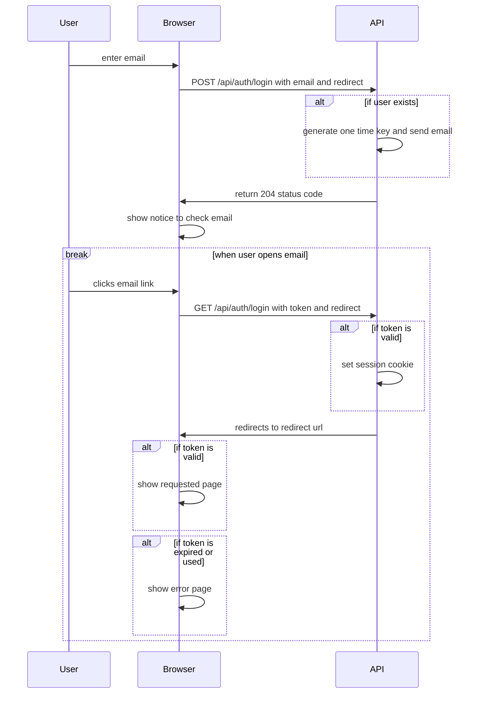

# Authentication

We are using [lucia](https://lucia-auth.com/) to manage authentication and session.
Authentication is handled on the api server since there are plans to have multiple apps with a common login.

Presently, only magic links sent via an email are supported. We may add passwords and SSO options later. Only existing users are able to log in. New users must be invited by a system or language admin.

## Login in Dev Environments

In local environments, emails are just logged to the terminal rather than sending to an SMTP server. To log in, copy and paste the link that would have been sent in the email.

## Authentication Flow

## Cookies

**`auth_session`** - This cookie has the session ID that is used to look up the session in the database on the server.
